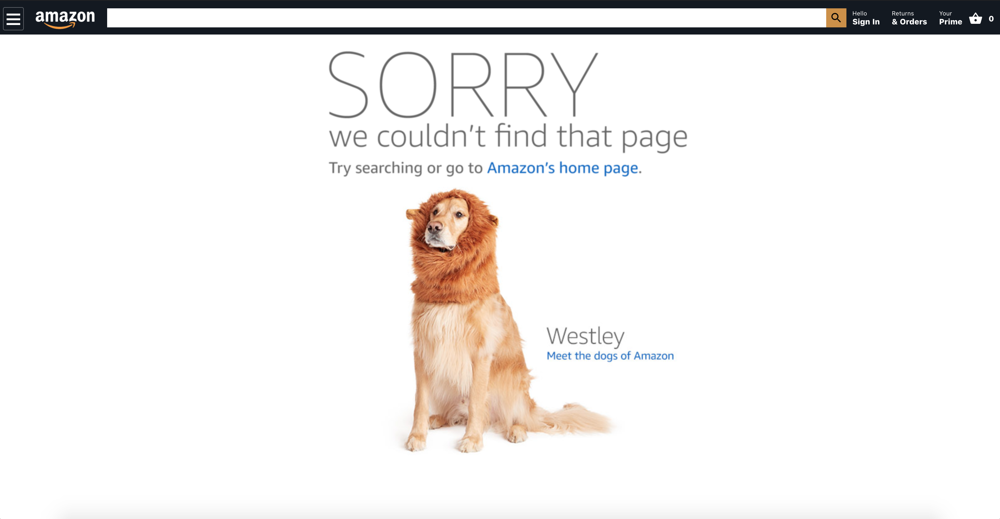

<h1 align="center">
    
</h1>
<h1 align="center">
    
</h1>

## 💻 About project (fully responsive)

Personal project built using ReactJS with Hooks, Context API and Redux. You can sign in and logout using firebase and even create a account. Also, there are some products where you can add and remove from basket, using Context API and Redux. Enjoy it.

Site: https://amazonclonelmr.netlify.app/

## 🛠 Technology

#### **Website**

-   **[HTML5](https://developer.mozilla.org/pt-BR/docs/Web/HTML/HTML5)**
-   **[CSS3](https://www.w3schools.com/css/)**
-   **[ReactJs](https://pt-br.reactjs.org/)** : **[React Hooks, Context API, Redux](https://pt-br.reactjs.org/docs/hooks-intro.html)**, **[react-router-dom](https://reactrouter.com/web/guides/quick-start)**, **[React Slideshow Image](https://www.npmjs.com/package/react-slideshow-image)**
-   **[Firebase](https://firebase.google.com/?hl=pt-br)**

#### **Utilitaries**

-   Editor: **[Visual Studio Code](https://code.visualstudio.com/)**
-   Icons: **[Feather and Font Awesome](https://react-icons.github.io/react-icons/)**

### Prerequisites

Before you begin, you will need to have the following tool installed on your machine:
[Git](https://git-scm.com)

In addition, it is good to have an editor to work with the code as **[VSCode](https://code.visualstudio.com/)**

### Running the web application (Front End)

```bash
# Clone this repository
$ git clone https://github.com/luizmr/amazon-clone-app.git

# Access the project folder in the cmd/terminal
$ cd amazon-clone-app

# Use the command below to install all dependencies
$ npm install

# Run the application on terminal
$ npm start

# The server is now running at localhost:3000
```

## 📝 License

This project is under the MIT license.

Made with ❤️ by Luiz Marcelo Rocha
